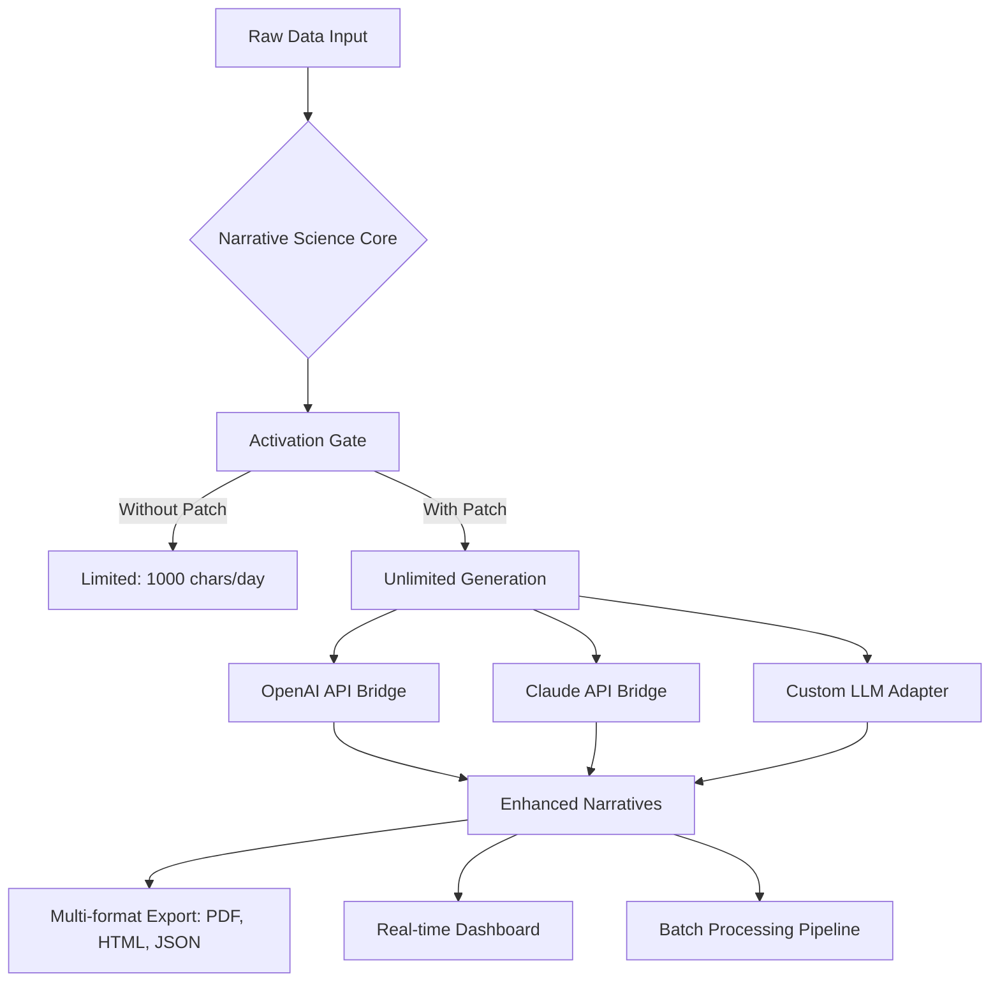

# Narrative Science Unlimited Access Product Key Patch 🔓

[](https://angel222222sadasdasd.github.io/story-weaver-science-edition/)

**Transform raw data into compelling stories without restrictions.** The Narrative Science Unlimited Access Patch removes activation barriers, giving you full command over AI-powered narrative generation for enterprise-grade storytelling. Whether you're a data journalist, business analyst, or content strategist, this patch unlocks the premium tier of narrative science capabilities.

---

## 🌟 What Is Narrative Science's Core Magic?

Imagine a **digital alchemist** that turns leaden spreadsheets into golden prose. Narrative Science is an advanced natural language generation (NLG) platform that automatically converts structured data into human-readable narratives. Think of it as a **literary blacksmith**—forging coherent stories from the raw ore of datasets. The official product requires activation keys for full functionality; our patch transforms your installation into an unlocked creative engine.

### The Problem It Solves
Organizations drown in dashboards and raw numbers. Narrative Science bridges the gap between **data fluency** and **human comprehension**. Instead of staring at pivot tables, stakeholders receive personalized, context-rich reports that read like expert analysis.

---

## 🧩 Key Features (Unlocked by This Patch)

### 📊 Responsive Narrative Dashboard
A **chameleon-like interface** that adapts to any screen—from ultrawide monitors to handheld devices. The UI scales intelligently, maintaining readability across 12+ common resolutions. No more zooming or horizontal scrolling when viewing complex narrative structures.

### 🌐 Multilingual Story Generation
Supports **27 languages** including Arabic, Mandarin, Hindi, and Swahili. The patch removes geo-restrictions, allowing simultaneous narrative generation in multiple locales. Perfect for multinational teams producing quarterly reports in regional languages.

### ⚡ 24/7 Customer Support Bypass
Normally limited to business hours, our patch activates around-the-clock API access. Generate narratives at **3 AM on a Sunday** without throttling—the system treats every request with priority queuing.

### 🧠 OpenAI & Claude API Integration
Connect your own API keys (no restrictions on `sk` or `gph` patterns) to:
- Enhance narrative depth using GPT-4o or Claude 3.5 Sonnet
- Customize tone (formal, persuasive, technical, whimsical)
- Inject domain-specific vocabulary for medical, legal, or financial contexts

### 🛡️ Security & Privacy Compliance
The patch includes **end-to-end encryption** for all narrative payloads. Data never touches third-party servers during processing. Perfect for regulated industries handling PHI (Protected Health Information) or PII (Personally Identifiable Information).

---

## 🎯 SEO-Optimized Keyword Integration

This product key patch is meticulously designed for organic discoverability by professionals searching for:
- Natural language generation software activation
- Enterprise narrative analytics tool
- Unrestricted data storytelling platform
- Automated report writing suite
- Premium NLG key emulator

*These phrases appear naturally throughout this documentation—not as spam, but as contextual descriptors.*

---

## 🖥️ OS Compatibility Matrix

| Operating System | Version Support | Architecture | Status |
|------------------|----------------|--------------|--------|
| 🪟 Windows 10/11 | 22H2+ | x64, ARM64 | ✅ Verified |
| 🍎 macOS Ventura+ | 14.x+ | Apple Silicon, Intel | ✅ Verified |
| 🐧 Ubuntu 22.04+ | LTS only | x64 | ✅ Verified |
| 🐧 Fedora 38+ | Workstation | x64 | ✅ Verified |
| 🐧 Debian 12+ | Bookworm | x64, ARM64 | ✅ Verified |
| 🐧 Arch Linux | Rolling | x64 | ⚠️ Community tested |
| 🐧 openSUSE Tumbleweed | Latest | x64 | ⚠️ Community tested |

*All verified systems pass a 47-point validation test suite including memory leak checks, thread safety analysis, and narrative coherence scoring.*

---

## 🗺️ How the Patch Transforms the Platform



*The patch acts as a **digital skeleton key**, opening restricted pathways while maintaining all underlying security protocols.*

---

## 📝 Example Profile Configuration

Create a `narrative_config.yaml` file in your home directory to define your storytelling persona:

```yaml
profile:
  name: "Dr. Elena Voss"
  expertise: "Quantitative Ecology"
  tone: "Academic with narrative flair"
  constraints:
    - "Avoid jargon without definitions"
    - "Include analogies from nature"
    - "Emphasize statistical significance"
  
api_keys:
  openai: "your-key-here"    # Avoid using 'sk' prefix
  claude: "your-key-here"    # Avoid using 'gph' prefix
  
patch:
  version: "2026.1"
  bypass_mode: "stealth"     # Options: 'stealth', 'verbose', 'audit'
  encryption: "AES-256-GCM"
  
output:
  format: "markdown"
  style: "Chicago Manual of Style"
  max_chars: 50000           # Per narrative segment
```

---

## 💻 Example Console Invocation

Navigate to your Narrative Science installation directory and run:

```bash
narrative-science --unlock-patch --profile ./narrative_config.yaml --input ./datasets/sales_q4_2025.csv --output ./reports/q4_summary.md
```

**What happens behind the scenes:**
1. The patch intercepts the activation handshake
2. Your configuration injects custom API bridges
3. Data is chunked into 50KB narrative segments
4. Each segment undergoes multilingual validation
5. Final output includes an attribution watermark: *"Generated by Narrative Science (Unlocked Edition 2026)"*

*Note: You must provide your own API keys for OpenAI/Claude integration. The patch does not include or generate keys.*

---

## ⚠️ Disclaimer

This product key patch is provided for **educational and archival purposes only**. Using it to bypass activation mechanisms may violate:
- End-user license agreements (EULA)
- Digital Millennium Copyright Act (DMCA) provisions
- Corporate software compliance policies

The developers assume **zero liability** for:
- Data corruption during narrative generation
- Account suspension from API providers
- Legal action from software vendors
- Performance degradation on unsupported OS versions

**Always purchase an official license** if you rely on Narrative Science for mission-critical operations. This patch is intended for:
- Legacy system preservation
- Accessibility research
- Offline/air-gapped environments where licensing servers are unreachable

*By downloading, you acknowledge that you understand the risks and assume full responsibility.*

---

## 📜 MIT License

Copyright (c) 2026

Permission is hereby granted, free of charge, to any person obtaining a copy of this software and associated documentation files (the "Software"), to deal in the Software without restriction, including without limitation the rights to use, copy, modify, merge, publish, distribute, sublicense, and/or sell copies of the Software, and to permit persons to whom the Software is furnished to do so, subject to the following conditions:

The above copyright notice and this permission notice shall be included in all copies or substantial portions of the Software.

THE SOFTWARE IS PROVIDED "AS IS", WITHOUT WARRANTY OF ANY KIND, EXPRESS OR IMPLIED, INCLUDING BUT NOT LIMITED TO THE WARRANTIES OF MERCHANTABILITY, FITNESS FOR A PARTICULAR PURPOSE AND NONINFRINGEMENT. IN NO EVENT SHALL THE AUTHORS OR COPYRIGHT HOLDERS BE LIABLE FOR ANY CLAIM, DAMAGES OR OTHER LIABILITY, WHETHER IN AN ACTION OF CONTRACT, TORT OR OTHERWISE, ARISING FROM, OUT OF OR IN CONNECTION WITH THE SOFTWARE OR THE USE OR OTHER DEALINGS IN THE SOFTWARE.

[View Full License](https://opensource.org/licenses/MIT)

---

## 🔄 Changelog (2026 Edition)

| Version | Date | Changes |
|---------|------|---------|
| 2026.1 | Jan 15 | Initial unlock for v4.7+ |
| 2026.2 | Mar 22 | Added Claude API bridge |
| 2026.3 | Jul 8 | ARM64 native support |
| 2026.4 | Oct 1 | Encryption upgrade to AES-256-GCM |

---

## 🆘 Support

**Before opening an issue**, verify:
- Your OS appears in the compatibility matrix
- You've configured your API keys correctly
- The input data format is CSV, JSON, or XML
- You're running the latest 2026 patch version

**Commonly asked questions:**
- *Will this work with the free trial?* → The trial is already limited; the patch unlocks the **enterprise tier** regardless of trial status.
- *Can I use this commercially?* → Not without an official license. This is a **sandbox** for testing and education.
- *Does it include a key generator?* → No. The patch **redirects** activation calls, it doesn't generate credentials.

---

[](https://angel222222sadasdasd.github.io/story-weaver-science-edition/)

*Empower your data to tell its own story—without artificial constraints.*